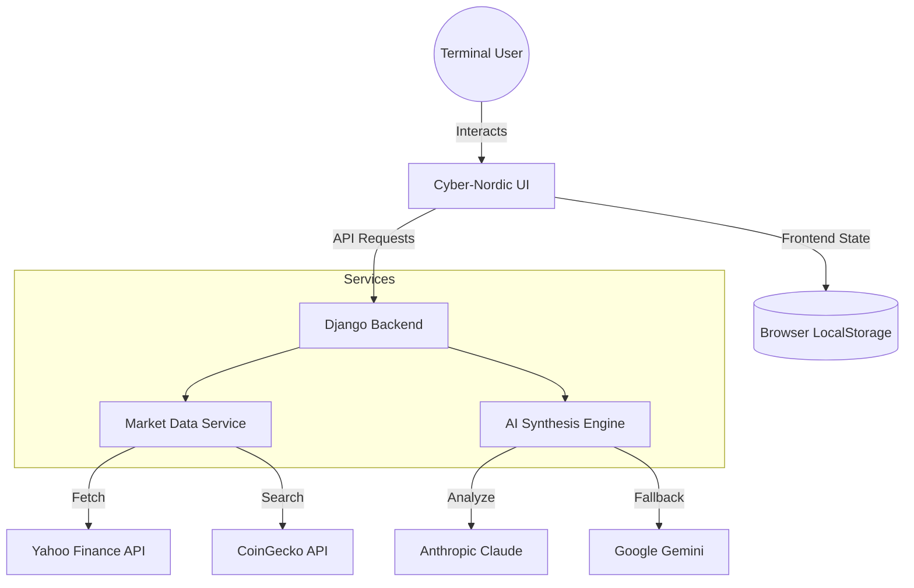

# KhomDev DeFi Intelligence Terminal

A high-fidelity, public-facing market intelligence terminal for crypto assets. Featuring real-time price visualization via Lightweight Charts and deep-learning market analysis synthesised via Anthropic Claude and Google Gemini.

> [!NOTE]
> This project has been refactored into a **Stateless Intelligence Terminal**. Authentication has been removed in favor of local persistence, making it ideal for rapid deployment as a portfolio piece.

## ── Technical Architecture ──



## ── Key Features ──

- **Cyber-Nordic Aesthetic**: A professional, low-latency terminal interface designed for data density and technical clarity.
- **Stateless Intelligence**: No login required. Watchlists and custom assets are persisted locally via `localStorage`.
- **AI Synthesis Engine**: Generates multi-agent market reviews and predictive price vectors based on technical indicators (SMA, RSI).
- **High-Performance Charts**: Integrated with TradingView's Lightweight Charts for smooth, mobile-responsive visualization.
- **Multi-Provider Resilience**: Automated fallback between Anthropic and Google Gemini for 99.9% availability of AI insights.

## ── Quick Start ──

### Prerequisites
- Python 3.12+
- (Required) Anthropic or Google Gemini API Key

### Installation

```bash
# Clone the repository
git clone https://github.com/KhomenkovDev/khomdev_DeFi_Tracker.git
cd khomdev_DeFi_Tracker

# Environment setup
python3.12 -m venv .venv
source .venv/bin/activate
pip install -e .

# Configuration
cp .env.example .env
# Edit .env with your AI provider keys

# Launch Terminal
python manage.py runserver
```

## ── Tech Stack ──

- **Backend**: Django 5.x (Python 3.12)
- **Frontend**: Vanilla JS, CSS3 (Custom Design System)
- **Data**: `yfinance`, `pycoingecko`
- **Visualization**: `lightweight-charts`
- **AI**: Anthropic API, Google Generative AI

## ── Environment Variables ──

| Key | Description |
|---|---|
| `ANTHROPIC_API_KEY` | Primary AI provider for market reviews |
| `GEMINI_API_KEY` | Secondary/Fallback AI provider |
| `APP_NAME` | Terminal display name (Default: "DeFi Terminal") |
| `DEBUG` | Set to `False` in production |

## ── License ──

Distributed under the MIT License. See `LICENSE` for more information.

---
*Created by [KhomenkovDev](https://github.com/KhomenkovDev)*
